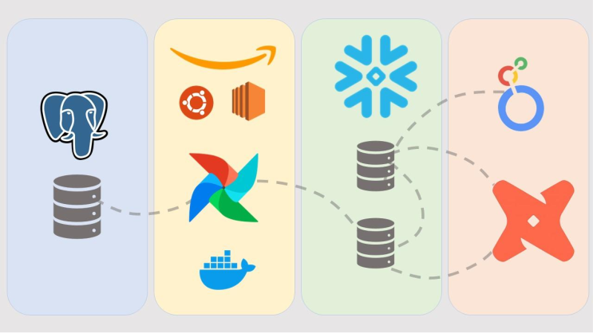
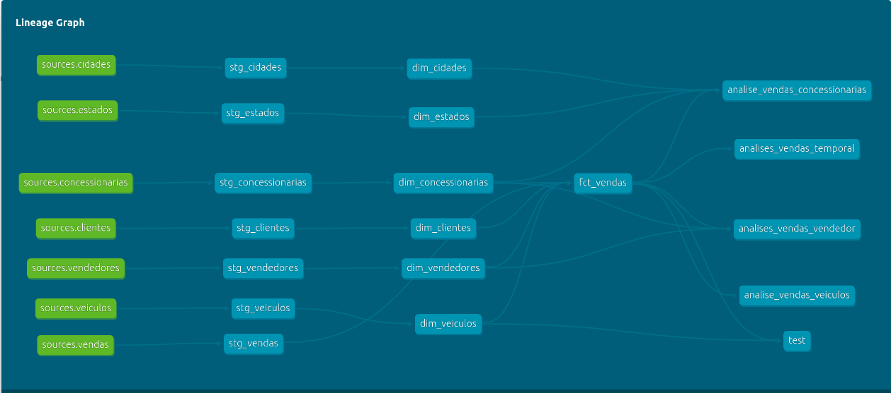

# Introdução
 
Bootcamp promovido pelo professor Fernando Amaral disponível através deste link¹, com o objetivo de disseminar conhecimentos na área de engenharia de dados. O projeto consiste em um problema clássico de construção de um datawarehouse para uma empresa fictícia chamada Nova Drive Motors².

# Metodologia
 
A arquitetura do projeto pode ser vista através da imagem abaixo: 

- Exploração de daodos

Visando conhecer os dados em questão. Foi realizado uma etapa de análise exploratória dos dados utilizando a ferramenta Dbeaver para se conectar ao banco operacional e a utilização da linguagem SQL para a realização das análises. Essas análises foram organizadas em um arquivo SQL contendo perguntas de negócio.

- Pipeline

O pipeline de extração e carga é orquestrado através do Airflow configurado com Docker em um servidor virtual EC2 da AWS. Os dados brutos são extraidos do banco operacional(Postgres) e armazenados diretamente no banco(Stage) do snowflake.

- Processo de transformação de dados e teste

Com os dados brutos armazenados, foi escolhido a ferramenta DBT para transformar-los no formato adequado para as análises e modelados em dimensões e fatos (star schema). Nesta etapa também foi implementado um etapa de teste para verificar se o datawarehouse estava funcionando corretamente de acordo com as regras de negócio da Nova Drive Motors. 

- Deploy

O deploy foi realizado na ferramenta DBT, após os testes serem concluídos.

- Dashboard

Apesar de não ser o foco do projeto um dashboard foi construido após a camada analítica ser desenvolvida no DBT. A construção do dashboard se deu por meio do Looker Studio contendo gráficos e análises simples para consultas. 

# Resultado

O datawarehouse foi construido com sucesso e contém todas as suas fases funcionando perfeitamente, abaixo a imagem da linhagem dos dados '. O dashboard com as análises podem ser acessado através deste link³.

# Referências

¹ - https://www.udemy.com/course/bootcamp-engenharia-de-dados/

² - https://www.novadrivemotors.com.br/

³ - https://lookerstudio.google.com/s/lOC0_zQKXB8
